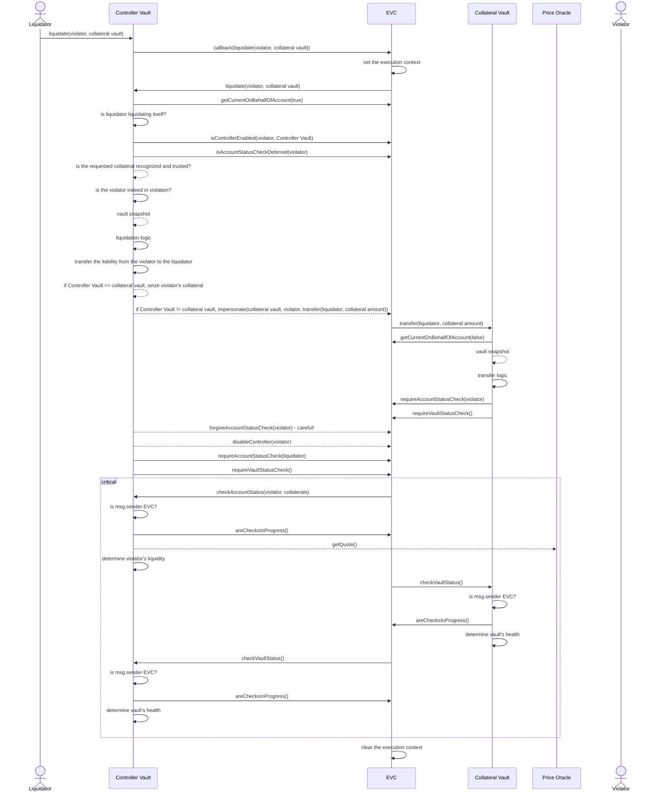

```mermaid
sequenceDiagram
    actor Liquidator
    participant Controller Vault
    participant EVC
    participant Collateral Vault
    participant Price Oracle
    actor Violator

    Liquidator->>Controller Vault: liquidate(violator, collateral vault)
    Controller Vault->>EVC: callback(liquidate(violator, collateral vault))
    EVC->>EVC: set the execution context
    EVC->>Controller Vault: liquidate(violator, collateral vault)

    Controller Vault->>EVC: getCurrentOnBehalfOfAccount(true)
    Controller Vault->>Controller Vault: is liquidator liquidating itself?
    Controller Vault->>EVC: isControllerEnabled(violator, Controller Vault)
    Controller Vault->>EVC: isAccountStatusCheckDeferred(violator)
    Controller Vault-->>Controller Vault: is the requested collateral recognized and trusted?
    Controller Vault->>Controller Vault: is the violator indeed in violation?
    Controller Vault-->>Controller Vault: vault snapshot
    Controller Vault->>Controller Vault: liquidation logic
    Controller Vault->>Controller Vault: transfer the liability from the violator to the liquidator
    Controller Vault-->>Controller Vault: if Controller Vault == collateral vault, seize violator's collateral

    Controller Vault-->>EVC: if Controller Vault != collateral vault, impersonate(collateral vault, violator, transfer(liquidator, collateral amount))
    EVC->>Collateral Vault: transfer(liquidator, collateral amount)
    Collateral Vault->>EVC: getCurrentOnBehalfOfAccount(false)
    Collateral Vault-->>Collateral Vault: vault snapshot
    Collateral Vault->>Collateral Vault: transfer logic
    Collateral Vault->>EVC: requireAccountStatusCheck(violator)
    Collateral Vault->>EVC: requireVaultStatusCheck()

    Controller Vault-->>EVC: forgiveAccountStatusCheck(violator) - careful!
    Controller Vault-->>EVC: disableController(violator)
    Controller Vault->>EVC: requireAccountStatusCheck(liquidator)
    Controller Vault->>EVC: requireVaultStatusCheck()

    critical
        EVC->>Controller Vault: checkAccountStatus(violator, collaterals)
        Controller Vault->>Controller Vault: is msg.sender EVC?
        Controller Vault->>EVC: areChecksInProgress()
        Controller Vault-->>Price Oracle: getQuote()
        Controller Vault->>Controller Vault: determine violator's liquidity

        EVC->>Collateral Vault: checkVaultStatus()
        Collateral Vault->>Collateral Vault: is msg.sender EVC?
        Collateral Vault->>EVC: areChecksInProgress()
        Collateral Vault->>Collateral Vault: determine vault's health

        EVC->>Controller Vault: checkVaultStatus()
        Controller Vault->>Controller Vault: is msg.sender EVC?
        Controller Vault->>EVC: areChecksInProgress()
        Controller Vault->>Controller Vault: determine vault's health
    end

    EVC->>EVC: clear the execution context
```